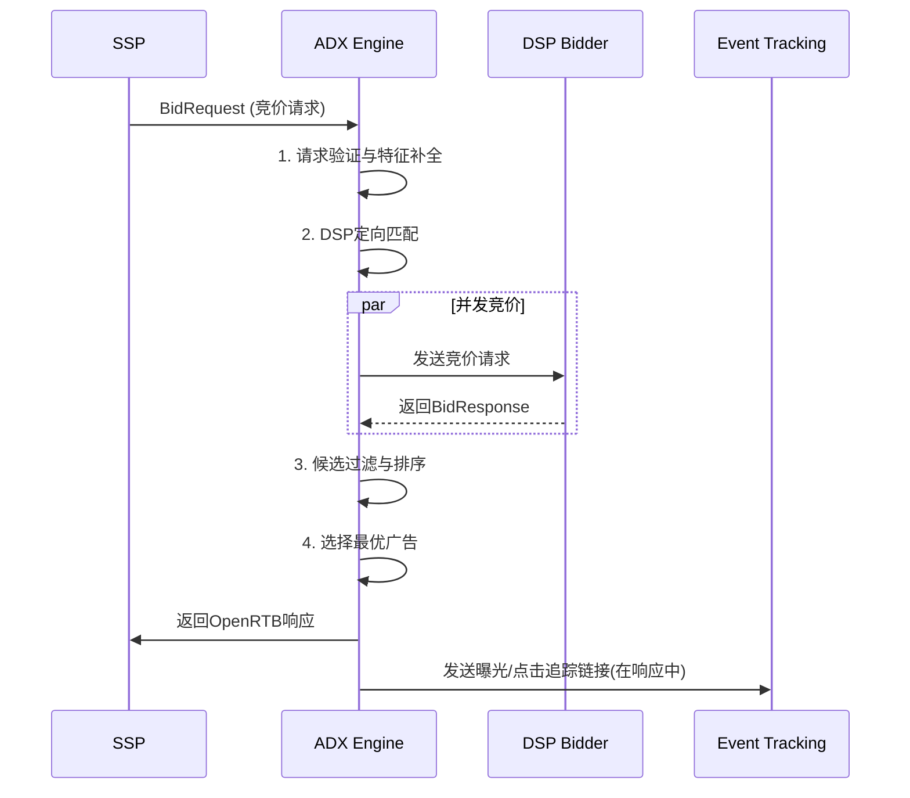
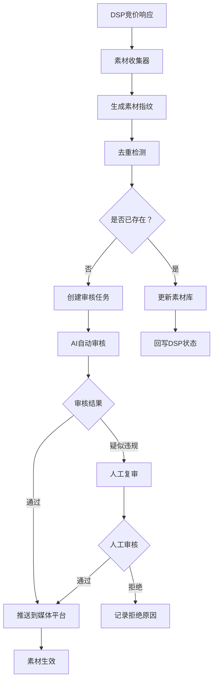
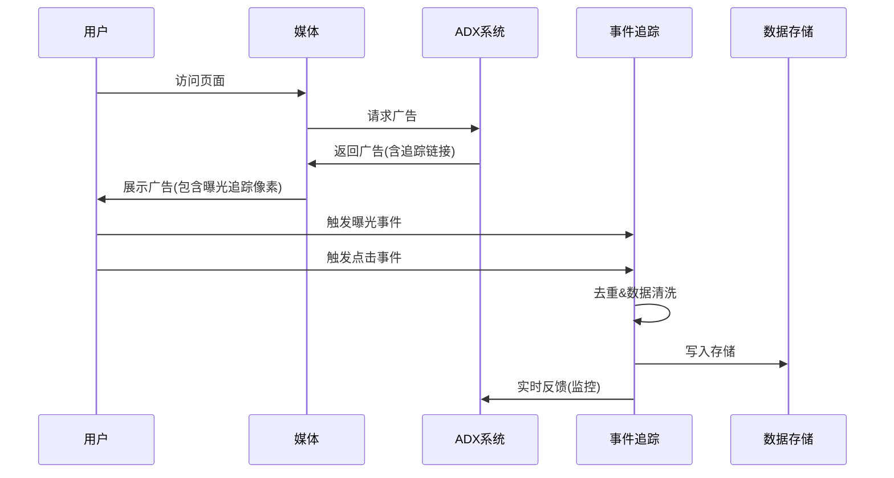

# ADX广告系统技术方案设计

## 目录
1. [系统概述](#系统概述)
2. [ADX引擎技术方案](#adx引擎技术方案)
3. [素材送审系统技术方案](#素材送审系统技术方案)
4. [事件追踪系统技术方案](#事件追踪系统技术方案)
5. [技术选型总结](#技术选型总结)

---

## 系统概述

### 当前项目基础
- 已有adx_engine基础架构
- 采用分层架构：adxserver → sspadapter → adxcore
- 支持OpenRTB协议标准
- 集成Prometheus监控
- 使用Gin框架作为HTTP服务

### 核心设计原则
- **高性能**：毫秒级响应，支持高并发
- **可扩展**：支持横向扩展，模块化设计
- **可观测**：完整的监控、日志、链路追踪
- **容错性**：具备熔断、降级、重试机制

---

## ADX引擎技术方案

### 1. 架构设计

#### 1.1 整体架构
```
┌─────────────────────────────────────────────────────────────┐
│                        接入层                                 │
│  ┌──────────────┐  ┌──────────────┐  ┌──────────────┐      │
│  │  SSP Adapter │  │  SSP Adapter │  │  SSP Adapter │      │
│  │   (快手)     │  │   (小米)     │  │   (巨量)     │      │
│  └──────────────┘  └──────────────┘  └──────────────┘      │
└─────────────────────────────────────────────────────────────┘
                            │
┌─────────────────────────────────────────────────────────────┐
│                      业务编排层                                │
│  ┌──────────────────────────────────────────────────────┐  │
│  │         ADX Server (竞价引擎核心)                     │  │
│  │  1. 请求验证与特征补全                                │  │
│  │  2. DSP定向(Targeting)                               │  │
│  │  3. 并发竞价广播                                     │  │
│  │  4. 候选过滤(Filtering)                              │  │
│  │  5. 排序与选择(Ranking)                              │  │
│  │  6. 响应打包(Packing)                                │  │
│  └──────────────────────────────────────────────────────┘  │
└─────────────────────────────────────────────────────────────┘
                            │
┌─────────────────────────────────────────────────────────────┐
│                       竞价执行层                               │
│  ┌──────────────┐  ┌──────────────┐  ┌──────────────┐      │
│  │ DSP bidder  │  │ DSP bidder  │  │ DSP bidder  │      │
│  │     A       │  │     B       │  │     C       │      │
│  └──────────────┘  └──────────────┘  └──────────────┘      │
└─────────────────────────────────────────────────────────────┘
```

#### 1.2 核心处理流程


### 2. 核心技术实现

#### 2.1 请求处理管道
```go
type ProcessingPipeline struct {
    stages []PipelineStage
    ctx    *BidRequestCtx
}

type PipelineStage interface {
    Process(ctx *BidRequestCtx) error
}

// 核心处理阶段
type stages struct {
    validationStage   *ValidationStage
    featureStage      *FeatureCompletionStage
    targetingStage    *DSPTargetingStage
    broadcastStage    *BroadcastStage
    filterStage       *FilterStage
    rankingStage      *RankingStage
    packingStage      *ResponsePackingStage
}
```

**关键特性：**
- **异步并发**：使用Goroutine池并发请求DSP，控制并发数
- **超时控制**：每个DSP请求设置独立超时（推荐100-300ms）
- **熔断机制**：DSP失败率超过阈值时自动熔断
- **重试策略**：支持指数退避重试

#### 2.2 DSP竞价广播器
```go
type BroadcastManager struct {
    bidderPool   *BidderPool
    timeout      time.Duration
    maxRetries   int
    circuitBreaker map[string]*CircuitBreaker
}

func (bm *BroadcastManager) Broadcast(ctx *BidRequestCtx) ([]*BidCandidate, error) {
    // 1. 获取目标DSP列表
    targetBidders := bm.selectBidders(ctx)

    // 2. 并发请求
    results := bm.concurrentRequest(targetBidders, ctx)

    // 3. 聚合结果
    return bm.aggregateResults(results), nil
}
```

**关键特性：**
- **智能路由**：基于QPS、延迟、历史成功率选择DSP
- **权重控制**：根据DSP竞价质量和历史表现动态调整
- **背压控制**：当队列积压时自动降级

#### 2.3 DSP定向(Targeting)引擎
```go
type TargetingEngine struct {
    rulesEngine *RulesEngine
    audienceMgr *AudienceManager
}

type TargetingRule struct {
    RuleID      string            `json:"rule_id"`
    Conditions  []Condition       `json:"conditions"`
    TargetDSPs  []string          `json:"target_dsps"`
    Priority    int               `json:"priority"`
    Enabled     bool              `json:"enabled"`
}

type Condition struct {
    Field     string      `json:"field"`      // user_age, geo, device_type, etc.
    Operator  string      `json:"operator"`   // eq, in, range, regex
    Value     interface{} `json:"value"`
}
```

**定向维度：**
- 用户画像：年龄、性别、地域
- 设备信息：设备类型、操作系统、浏览器
- 上下文：页面分类、时段、流量来源
- 商业定向：出价区间、广告类型

#### 2.4 响应排序算法
```go
type RankingAlgorithm struct {
    winrateModel *WinrateModel
    ecpmFloor    float64
}

type RankingFactor struct {
    CPMPrice       float64 `json:"cpm_price"`
    Winrate        float64 `json:"winrate"`        // 预估胜率
    QualityScore   float64 `json:"quality_score"`  // 广告质量分
    HistoricalCVR  float64 `json:"historical_cvr"` // 历史转化率
}

func (ra *RankingAlgorithm) Score(candidate *BidCandidate) float64 {
    // eCPM = CPM * Winrate * QualityWeight
    return candidate.CPMPrice * candidate.Winrate * candidate.QualityScore
}
```

### 3. 性能优化策略

#### 3.1 缓存策略
- **Redis缓存**：用户画像、频次控制、黑白名单
- **本地缓存**：DSP配置、路由规则（TTL 5-10分钟）
- **请求缓存**：相同请求的响应缓存（谨慎使用）

#### 3.2 连接池管理
```go
type DSPConnPool struct {
    pools map[string]*httputil.Pool
}

func (p *DSPConnPool) GetClient(bidderID string) *http.Client {
    // 为每个DSP维护独立连接池
    // 复用TCP连接，减少握手开销
}
```

#### 3.3 内存管理
- **对象池**：复用BidRequestCtx、BidCandidate对象
- **零拷贝**：减少JSON序列化/反序列化开销
- **GC优化**：避免频繁分配，使用sync.Pool

### 4. 技术选型

| 组件 | 选型 | 理由 |
|------|------|------|
| 协议标准 | OpenRTB 2.5 | 行业标准，兼容性好 |
| Web框架 | Gin | 高性能、成熟稳定 |
| 并发控制 | Goroutine + Context | Go原生支持，成本低 |
| 缓存 | Redis Cluster | 分布式、高可用 |
| 配置管理 | YAML + 热更新 | 易于维护 |
| 监控 | Prometheus | 轻量级、易集成 |
| 负载均衡 | Nginx/Envoy | 高性能、反向代理 |

---

## 素材送审系统技术方案

### 1. 系统架构

#### 1.1 整体架构
```
┌─────────────────────────────────────────────────────────────┐
│                      素材收集层                                │
│  ┌──────────────────────────────────────────────────────┐  │
│  │       素材收集器 (Material Collector)                  │  │
│  │  - 从DSP竞价响应中提取素材信息                         │  │
│  │  - 去重检测与指纹生成                                 │  │
│  └──────────────────────────────────────────────────────┘  │
└─────────────────────────────────────────────────────────────┘
                            │
┌─────────────────────────────────────────────────────────────┐
│                      素材处理层                                │
│  ┌──────────────┐  ┌──────────────┐  ┌──────────────┐      │
│  │  素材解析    │  │  素材审查    │  │  素材存储    │      │
│  │   (Parser)  │  │ (Moderator) │  │ (Storage)   │      │
│  └──────────────┘  └──────────────┘  └──────────────┘      │
└─────────────────────────────────────────────────────────────┘
                            │
┌─────────────────────────────────────────────────────────────┐
│                      审核服务层                                │
│  ┌──────────────────────────────────────────────────────┐  │
│  │     审核任务队列 (Review Queue Manager)               │  │
│  │  - 自动审核(AI模型)                                   │  │
│  │  - 人工复审                                           │  │
│  │  - 审核状态管理                                       │  │
│  └──────────────────────────────────────────────────────┘  │
└─────────────────────────────────────────────────────────────┘
                            │
┌─────────────────────────────────────────────────────────────┐
│                      审核接入层                                │
│  ┌──────────────┐  ┌──────────────┐  ┌──────────────┐      │
│  │  媒体平台A   │  │  媒体平台B   │  │  媒体平台C   │      │
│  │   审核API    │  │   审核API    │  │   审核API    │      │
│  └──────────────┘  └──────────────┘  └──────────────┘      │
└─────────────────────────────────────────────────────────────┘
```

#### 1.2 数据流程


### 2. 核心模块设计

#### 2.1 素材收集器
```go
type MaterialCollector struct {
    parser     MaterialParser
    deduper    DedupService
    storage    MaterialStorage
    queue      chan *MaterialTask
}

type MaterialTask struct {
    TaskID        string                `json:"task_id"`
    DSPID         string                `json:"dsp_id"`
    MaterialType  MaterialType          `json:"material_type"` // image/video/html
    MaterialData  map[string]interface{} `json:"material_data"`
    Fingerprint   string                `json:"fingerprint"`
    CreatedAt     time.Time             `json:"created_at"`
}

type MaterialParser interface {
    Parse(data []byte) (*ParsedMaterial, error)
    ExtractFeatures(mat *ParsedMaterial) (*MaterialFeatures, error)
}

type ParsedMaterial struct {
    URL       string            `json:"url"`
    Size      int               `json:"size"`
    Format    string            `json:"format"`
    Metadata  map[string]string `json:"metadata"`
    Hash      string            `json:"hash"`
}
```

**收集策略：**
- **实时收集**：从DSP竞价响应中实时提取
- **批量收集**：定时扫描历史数据
- **增量收集**：仅收集新素材

#### 2.2 去重检测系统
```go
type DedupService struct {
    cache      *MaterialCache
    similarity *SimilarityChecker
}

type SimilarityChecker struct {
    imageHash *ImageHash
    textHash  *TextHash
}

func (d *DedupService) CheckDuplicate(material *ParsedMaterial) (bool, string, float64) {
    // 1. 精确匹配（MD5/SHA256）
    exactMatch := d.checkExactMatch(material.Hash)
    if exactMatch {
        return true, exactMatch.MaterialID, 1.0
    }

    // 2. 感知哈希匹配（图像相似度）
    if material.Type == IMAGE {
        similarMats := d.findSimilarByHash(material)
        if len(similarMats) > 0 {
            return true, similarMats[0].MaterialID, similarMats[0].Similarity
        }
    }

    // 3. 文本相似度（广告文案）
    if material.Type == TEXT || material.Type == HTML {
        similarMats := d.findSimilarByText(material)
        if len(similarMats) > 0 {
            return true, similarMats[0].MaterialID, similarMats[0].Similarity
        }
    }

    return false, "", 0.0
}
```

**去重算法：**
- **精确匹配**：MD5/SHA256哈希（100%匹配）
- **感知哈希**：pHash、dHash（图像相似度 > 85%）
- **文本相似度**：SimHash、余弦相似度（文本相似度 > 90%）

#### 2.3 审核引擎
```go
type ReviewEngine struct {
    aiModerator *AIModerator
    manualQueue chan *ReviewTask
    rulesEngine *RulesEngine
}

type ReviewTask struct {
    TaskID       string         `json:"task_id"`
    Material     *ParsedMaterial `json:"material"`
    ReviewType   ReviewType      `json:"review_type"` // AUTO, MANUAL, HYBRID
    Priority     int             `json:"priority"`
    Status       ReviewStatus    `json:"status"`
    ReviewerID   string          `json:"reviewer_id,omitempty"`
    CreatedAt    time.Time       `json:"created_at"`
}

type AIModerator struct {
    imageModel *ImageClassificationModel
    textModel  *TextClassificationModel
    videoModel *VideoAnalysisModel
}

func (r *ReviewEngine) AutoReview(task *ReviewTask) (*ReviewResult, error) {
    var results []ReviewCheck

    // 1. 内容安全检查
    safetyResult := r.checkContentSafety(task.Material)
    results = append(results, safetyResult)

    // 2. 品牌审核
    brandResult := r.checkBrandCompliance(task.Material)
    results = append(results, brandResult)

    // 3. 尺寸规格检查
    specResult := r.checkSpecification(task.Material)
    results = append(results, specResult)

    // 4. 法律法规检查
    legalResult := r.checkLegalCompliance(task.Material)
    results = append(results, legalResult)

    return r.aggregateResults(results), nil
}
```

**审核维度：**
- **内容安全**：暴力、色情、违规内容
- **品牌合规**：商标使用、品牌授权
- **技术规格**：尺寸、格式、文件大小
- **法律法规**：广告法、行业规范
- **平台政策**：各媒体平台特殊要求

#### 2.4 素材存储
```go
type MaterialStorage struct {
    objectStore *ObjectStore  // S3/MinIO
    metadataDB  *MetadataDB   // MongoDB/PostgreSQL
    cdn         *CDNManager
}

type MaterialMetadata struct {
    MaterialID    string                 `json:"material_id"`
    DSPID         string                 `json:"dsp_id"`
    Type          MaterialType           `json:"type"`
    Status        MaterialStatus         `json:"status"` // PENDING, APPROVED, REJECTED, EXPIRED
    StorageURL    string                 `json:"storage_url"`
    CDNURL        string                 `json:"cdn_url"`
    ReviewResult  *ReviewResult          `json:"review_result"`
    ApprovedMedia []string               `json:"approved_media"` // 批准投放的媒体平台
    Features      *MaterialFeatures      `json:"features"`
    CreatedAt     time.Time              `json:"created_at"`
    UpdatedAt     time.Time              `json:"updated_at"`
}
```

### 3. 技术选型

| 组件 | 选型 | 理由 |
|------|------|------|
| 对象存储 | MinIO/S3 | 低成本、高可靠 |
| 元数据存储 | MongoDB | 文档型数据，灵活 |
| 任务队列 | Redis/RabbitMQ | 高性能、持久化 |
| AI审核 | 自建模型/第三方API | 可控性/集成便利 |
| CDN | CloudFlare/自建 | 加速素材加载 |
| 去重算法 | Bloom Filter + SimHash | 内存高效、速度快 |

---

## 事件追踪系统技术方案

### 1. 系统架构

#### 1.1 整体架构
```
┌─────────────────────────────────────────────────────────────┐
│                      事件接入层                                │
│  ┌──────────────┐  ┌──────────────┐  ┌──────────────┐      │
│  │   曝光事件   │  │   点击事件   │  │  转化事件    │      │
│  │ (Impression)│  │  (Click)    │  │(Conversion) │      │
│  └──────────────┘  └──────────────┘  └──────────────┘      │
└─────────────────────────────────────────────────────────────┘
                            │
┌─────────────────────────────────────────────────────────────┐
│                     事件处理层                                 │
│  ┌──────────────────────────────────────────────────────┐  │
│  │       事件收集器 (Event Collector)                    │  │
│  │  - 事件去重                                           │  │
│  │  - 数据清洗                                           │  │
│  │  - 链路追踪ID关联                                     │  │
│  └──────────────────────────────────────────────────────┘  │
└─────────────────────────────────────────────────────────────┘
                            │
┌─────────────────────────────────────────────────────────────┐
│                     事件路由层                                 │
│  ┌──────────────┐  ┌──────────────┐  ┌──────────────┐      │
│  │  实时计算    │  │  批量处理    │  │  对账结算    │      │
│  │ (Flink/Spark)│  │ (Hadoop/Spark)│  │ (Settlement) │      │
│  └──────────────┘  └──────────────┘  └──────────────┘      │
└─────────────────────────────────────────────────────────────┘
                            │
┌─────────────────────────────────────────────────────────────┐
│                     数据存储层                                 │
│  ┌──────────────┐  ┌──────────────┐  ┌──────────────┐      │
│  │   ClickHouse │  │   Kafka      │  │  PostgreSQL │      │
│  │  (OLAP存储)  │  │  (消息队列)  │  │  (关系库)   │      │
│  └──────────────┘  └──────────────┘  └──────────────┘      │
└─────────────────────────────────────────────────────────────┘
```

#### 1.2 事件追踪流程


### 2. 核心模块设计

#### 2.1 事件收集器
```go
type EventCollector struct {
    receiver   EventReceiver
    deduper    EventDeduper
    processor  EventProcessor
    router     EventRouter
}

type TrackingEvent struct {
    EventID        string                 `json:"event_id"`        // 事件唯一ID
    EventType      EventType              `json:"event_type"`      // impression, click, conversion
    RequestID      string                 `json:"request_id"`      // 竞价请求ID
    AdID           string                 `json:"ad_id"`           // 广告ID
    DSPID          string                 `json:"dsp_id"`          // DSP ID
    SSPID          string                 `json:"ssp_id"`          // SSP ID
    MaterialID     string                 `json:"material_id"`     // 素材ID
    UserID         string                 `json:"user_id"`         // 脱敏用户ID
    DeviceInfo     *DeviceInfo            `json:"device_info"`
    Timestamp      time.Time              `json:"timestamp"`
    IP             string                 `json:"ip"`
    UserAgent      string                 `json:"user_agent"`
    RefURL         string                 `json:"ref_url"`         // 页面URL
    CustomParams   map[string]interface{} `json:"custom_params"`
}

type EventReceiverPixel(ctx *gin.Context) interface {
    Receive error     // 1x1像素接收
    ReceiveJSON(ctx *gin.Context) error      // JSON API接收
    ReceiveBeacon(ctx *gin.Context) error    // Beacon API接收
}
```

**事件类型：**
- **曝光事件(Impression)**：广告被展示时触发
- **点击事件(Click)**：用户点击广告时触发
- **转化事件(Conversion)**：用户完成转化行为时触发

#### 2.2 事件去重与清洗
```go
type EventDeduper struct {
    redis     *redis.Client
    window    time.Duration // 去重窗口期
}

type EventProcessor struct {
    validator EventValidator
    enricher EventEnricher
}

func (e *EventCollector) ProcessEvent(event *TrackingEvent) error {
    // 1. 事件去重
    isDuplicate := e.deduper.IsDuplicate(event)
    if isDuplicate {
        return ErrDuplicateEvent
    }

    // 2. 数据验证
    if err := e.processor.validator.Validate(event); err != nil {
        return err
    }

    // 3. 数据补全
    enrichedEvent := e.processor.enricher.Enrich(event)

    // 4. 事件路由
    return e.router.Route(enrichedEvent)
}

type EventEnricher struct {
    geoIP      *GeoIPService
    userAgent  *UserAgentParser
    cpmCache   *RedisCache
}

func (e *EventEnricher) Enrich(event *TrackingEvent) *TrackingEvent {
    // 1. 地理位置解析
    geo := e.geoIP.Lookup(event.IP)
    event.GeoInfo = geo

    // 2. 设备信息解析
    device := e.userAgent.Parse(event.UserAgent)
    event.DeviceInfo = device

    // 3. 补全CPM价格（用于对账）
    cpm := e.cpmCache.Get(event.RequestID)
    event.CPMPrice = cpm

    return event
}
```

#### 2.3 事件路由与分发
```go
type EventRouter struct {
    kafkaProducer *kafka.Producer
    clickhouse    *clickhouse.DB
    realtimeCalc  *RealtimeCalculator
}

func (r *EventRouter) Route(event *TrackingEvent) error {
    // 1. 实时计算（监控告警）
    go func() {
        r.realtimeCalc.Process(event)
    }()

    // 2. 写入OLAP存储（ClickHouse）
    if err := r.writeToOLAP(event); err != nil {
        return err
    }

    // 3. 发送到Kafka（流式处理）
    if err := r.kafkaProducer.Publish(event); err != nil {
        return err
    }

    return nil
}
```

#### 2.4 实时监控与告警
```go
type RealtimeCalculator struct {
    redis       *redis.Client
    alertMgr    *AlertManager
    windowSize  time.Duration
}

func (r *RealtimeCalculator) Process(event *TrackingEvent) {
    // 1. 更新实时指标
    r.updateMetrics(event)

    // 2. 异常检测
    r.detectAnomaly(event)

    // 3. 触发告警
    if r.isAnomalyDetected(event) {
        r.alertMgr.SendAlert(event)
    }
}

func (r *RealtimeCalculator) updateMetrics(event *TrackingEvent) {
    // CTR = Clicks / Impressions
    r.redis.Incr("counter:clicks:" + event.AdID)
    r.redis.Incr("counter:impressions:" + event.AdID)

    // 实时计算CTR
    clicks := r.redis.Get("counter:clicks:" + event.AdID)
    impressions := r.redis.Get("counter:impressions:" + event.AdID)
    ctr := float64(clicks) / float64(impressions) * 100

    r.redis.Set("metric:ctr:"+event.AdID, ctr)
}
```

### 3. 对账结算系统

#### 3.1 数据模型
```go
type SettlementRecord struct {
    RecordID      string    `json:"record_id"`
    Date          string    `json:"date"` // YYYY-MM-DD
    DSPID         string    `json:"dsp_id"`
    SSPID         string    `json:"ssp_id"`
    AdID          string    `json:"ad_id"`
    MaterialID    string    `json:"material_id"`

    Impressions   int64     `json:"impressions"`
    Clicks        int64     `json:"clicks"`
    Conversions   int64     `json:"conversions"`

    CPM           float64   `json:"cpm"`        // 千次展示成本
    CPC           float64   `json:"cpc"`        // 单次点击成本
    CPA           float64   `json:"cpa"`        // 单次转化成本

    Revenue       float64   `json:"revenue"`    // 收入
    Cost          float64   `json:"cost"`       // 成本
    Profit        float64   `json:"profit"`     // 利润

    CreatedAt     time.Time `json:"created_at"`
}

type ReconciliationService struct {
    dataSource   *ClickHouse
    settlementDB *PostgreSQL
    generator    ReportGenerator
}

func (s *ReconciliationService) GenerateDailyReport(date string) (*SettlementReport, error) {
    // 1. 从ClickHouse聚合数据
    rawData, err := s.aggregateEventData(date)
    if err != nil {
        return nil, err
    }

    // 2. 计算费用
    calculated := s.calculateSettlement(rawData)

    // 3. 与DSP/SSP对账
    discrepancies := s.reconcileWithPartners(calculated)

    // 4. 生成对账报告
    report := &SettlementReport{
        Date:          date,
        TotalRevenue:  calculated.TotalRevenue,
        TotalCost:     calculated.TotalCost,
        TotalProfit:   calculated.TotalProfit,
        Discrepancies: discrepancies,
    }

    // 5. 保存报告
    return s.generator.Generate(report)
}
```

#### 3.2 追踪链接生成
```go
type TrackingLinkBuilder struct {
    baseURL     string
    secretKey   string
}

func (t *TrackingLinkBuilder) BuildImpressionURL(params *TrackingParams) string {
    // impression tracking pixel: https://track.adx.com/pixel?e=imp&...
    query := url.Values{
        "e":      {"imp"},
        "req_id": {params.RequestID},
        "ad_id":  {params.AdID},
        "dsp_id": {params.DSPID},
        "ts":     {strconv.FormatInt(time.Now().Unix(), 10)},
    }

    // 添加签名防止篡改
    signature := t.signature(query.Encode())
    query.Set("sig", signature)

    return fmt.Sprintf("%s/pixel?%s", t.baseURL, query.Encode())
}

func (t *TrackingLinkBuilder) BuildClickURL(params *TrackingParams) string {
    // click tracking: https://track.adx.com/click?e=clk&...
    query := url.Values{
        "e":      {"clk"},
        "req_id": {params.RequestID},
        "ad_id":  {params.AdID},
        "dsp_id": {params.DSPID},
        "ts":     {strconv.FormatInt(time.Now().Unix(), 10)},
        "dest":   {params.DestinationURL}, // 落地页
    }

    signature := t.signature(query.Encode())
    query.Set("sig", signature)

    return fmt.Sprintf("%s/click?%s", t.baseURL, query.Encode())
}
```

### 4. 技术选型

| 组件 | 选型 | 理由 |
|------|------|------|
| 事件接入 | Gin + Redis | 高性能接收、内存缓存 |
| 流处理 | Apache Flink | 实时计算、低延迟 |
| OLAP存储 | ClickHouse | 列式存储、高压缩比、适合分析 |
| 消息队列 | Kafka | 高吞吐、持久化 |
| 关系库 | PostgreSQL | 事务支持好、对账数据准确 |
| 地理IP | MaxMind GeoIP2 | 精准地理位置 |
| 缓存 | Redis Cluster | 高性能、分布式 |

---

## 技术选型总结

### 核心技术栈

| 系统 | 核心组件 | 备选方案 |
|------|----------|----------|
| **ADX引擎** | Go + Gin + Redis + OpenRTB | Java + Spring Boot, Node.js |
| **素材送审** | Go + MongoDB + MinIO + AI审核 | Python + Django + MySQL |
| **事件追踪** | Go + ClickHouse + Kafka + Flink | Java + Flink + Doris |

### 部署架构

```
┌─────────────────────────────────────────────────────────────┐
│                       负载均衡层                               │
│                (Nginx/Envoy + SSL)                          │
└─────────────────────────────────────────────────────────────┘
                            │
┌─────────────────────────────────────────────────────────────┐
│                       应用服务层                               │
│  ┌──────────────┐  ┌──────────────┐  ┌──────────────┐      │
│  │  ADX Engine  │  │ Material     │  │ Event        │      │
│  │   (多实例)   │  │ Review       │  │ Tracking     │      │
│  └──────────────┘  └──────────────┘  └──────────────┘      │
└─────────────────────────────────────────────────────────────┘
                            │
┌─────────────────────────────────────────────────────────────┐
│                       数据存储层                               │
│  ┌──────────────┐  ┌──────────────┐  ┌──────────────┐      │
│  │   Redis      │  │  ClickHouse  │  │   Kafka      │      │
│  │   (集群)     │  │   (集群)     │  │   (集群)     │      │
│  └──────────────┘  └──────────────┘  └──────────────┘      │
│  ┌──────────────┐  ┌──────────────┐  ┌──────────────┐      │
│  │  MongoDB     │  │ PostgreSQL   │  │   MinIO      │      │
│  │   (集群)     │  │   (主从)     │  │   (集群)     │      │
│  └──────────────┘  └──────────────┘  └──────────────┘      │
└─────────────────────────────────────────────────────────────┘
```

### 性能指标

| 指标 | 目标值 | 说明 |
|------|--------|------|
| **ADX响应时间** | < 200ms | P99延迟 |
| **并发QPS** | > 50,000 | 单实例 |
| **素材审核** | < 30s | AI自动审核 |
| **事件延迟** | < 5s | 实时计算 |
| **数据准确性** | > 99.9% | 对账准确率 |
| **系统可用性** | > 99.99% | 年度SLA |

### 监控与告警

- **Prometheus**：核心指标监控
- **Grafana**：可视化大屏
- **Jaeger**：链路追踪
- **ELK Stack**：日志聚合与分析
- **PagerDuty**：告警通知

---

*文档版本：v1.0*
*最后更新：2025-12-08*